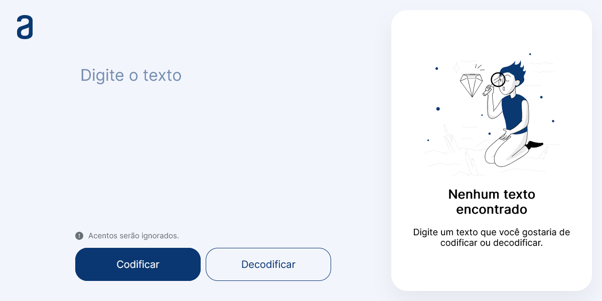

# Challenge ONE

Utilizando o dicionário sugerido, foi desenvolvida uma aplicação para codificação e decodificação de textos.

[🔗 Clique aqui para acessar](https://kennylima.github.io/Challenge_01_Oracle/)

## 🛠 Tecnologias 
- HTML
- CSS
- JavaScript
- Git
- Github

## 💻 Contato 

 > kennylima@hotmail.com